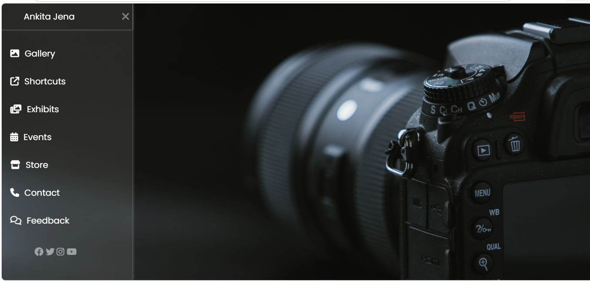

# CSS Mini Project

A responsive photography portfolio landing page built using **HTML5** and **CSS3**. The project features a modern CSS-only sliding sidebar navigation with smooth transitions, a fullscreen background image, and an elegant user interface. It demonstrates core front-end development concepts without relying on JavaScript.

---

## Overview

This project showcases a responsive landing page designed for a photography portfolio. The sidebar navigation is implemented entirely with CSS using the checkbox toggle technique, eliminating the need for JavaScript while maintaining a clean and interactive user experience.

The project emphasizes responsive design, modern UI principles, and efficient CSS styling practices.

---

## Features

* Responsive fullscreen layout
* CSS-only sliding sidebar navigation
* Modern and minimal interface
* Smooth hover effects and transitions
* Font Awesome icon integration
* Google Fonts (Poppins)
* Lightweight implementation with no JavaScript

---

## Technologies Used

* HTML5
* CSS3
* Font Awesome
* Google Fonts

---

## Project Structure

CSS-Mini-Project/
├── index.html
├── style.css
├── photo.jpg
├── preview.png
└── README.md

---

## Preview

---

## Learning Objectives

This project helped strengthen understanding of:

* Semantic HTML structure
* CSS positioning techniques
* Sidebar navigation implementation
* CSS transitions and animations
* Responsive web design principles
* Hover effects
* External font and icon libraries

---

## Getting Started

### Clone the repository

git clone https://github.com/ankita31jena/CSS-Mini-Project.git

### Run the project

Open `index.html` in any modern web browser.

No additional dependencies or installation steps are required.

---

## Future Enhancements

* Improved mobile responsiveness
* Gallery section
* Contact form
* Dark mode support
* Additional page animations
* Accessibility improvements

---

## Author

**Ankita Jena**

GitHub: https://github.com/ankita31jena

---

## License

This project is available for educational and personal use.

